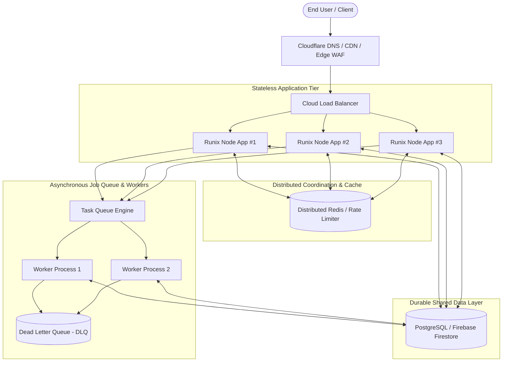
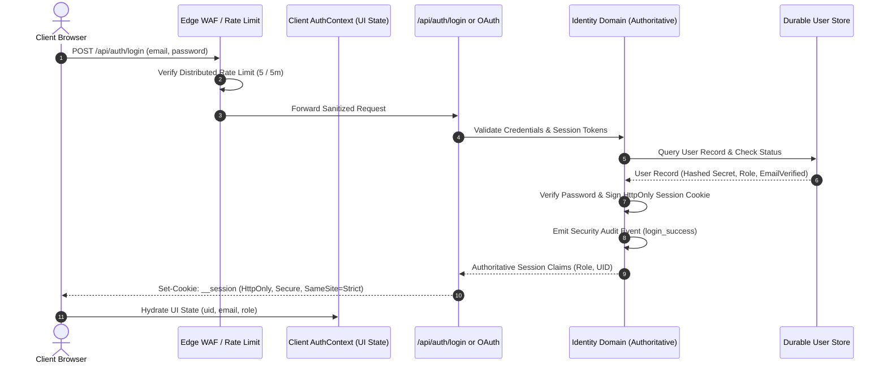
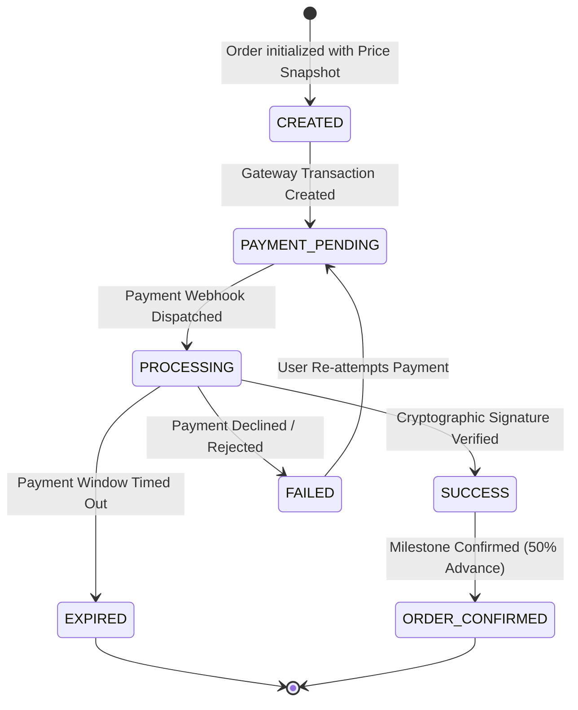
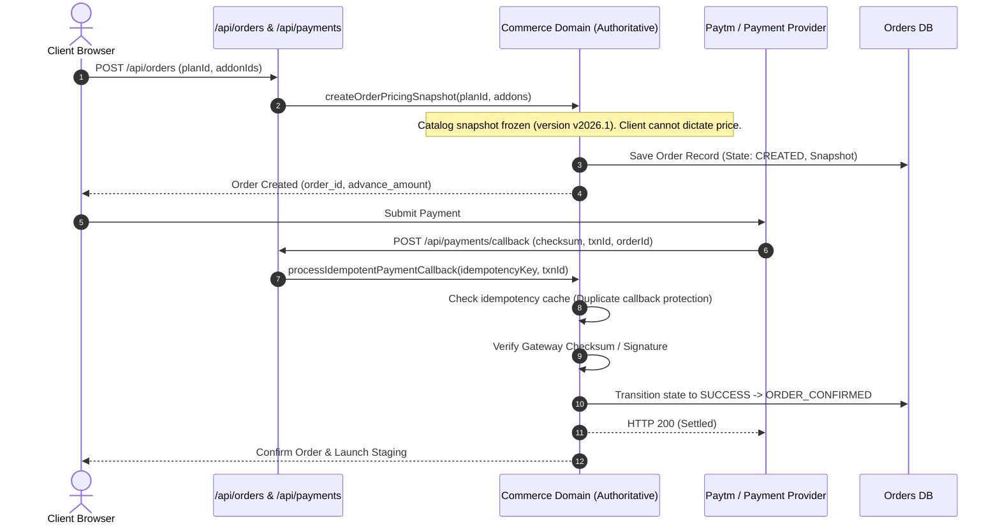

# Runix Production Architecture & Domain System

This document specifies the four architectural pillars of Runix.in for multi-instance stateless deployment, authoritative domain isolation, and real-world resilience.

---

## 1. System / Infrastructure Architecture

Stateless, horizontally scalable application nodes fronted by edge DNS/CDN and load balancing.



---

## 2. Authentication & Identity Architecture

Authoritative server-side identity verification with zero client trust and distributed rate-limited endpoints.



---

## 3. Commerce & Payment Architecture

Strict authoritative pricing snapshots, explicit payment state machine, and replay-proof idempotency keys.





---

## 4. Operations, Observability & Recovery Architecture

Real-time telemetry, structured sanitized logging, health checks, and resilient error tracking.

```mermaid
flowchart LR
    subgraph Traffic ["Traffic & Health"]
        Probe[Load Balancer Health Probe] -->|GET /api/health| APIHealth[/api/health]
        APIHealth -->|Status 200| OK[Healthy / In-Service]
    end

    subgraph Telemetry ["Telemetry & Auditing"]
        App[Application Code] -->|Structured Log| Logger[Observability Engine]
        Logger -->|Redact Passwords & Tokens| Sanitizer[Secret Redaction Filter]
        Sanitizer --> Storage[(Central Log Collector / CloudWatch)]
        App -->|Security Audit Event| Audit[(Immutable Audit Log)]
    end

    subgraph Resilience ["Backpressure & DLQ"]
        Workers[Background Workers] -->|On 3 Failures| DLQ[Dead Letter Queue]
        DLQ --> Alert[Ops Alerting & PagerDuty]
        Alert --> Recovery[Admin Reconciliation Run]
    end
```
